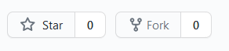

# Node-Video-Streaming

This is the Repo to demonstrate a streaming server for Videos in Node Js. This has the basic implementation of Video Streaming.
The server in this example sends the chunk of Video in every request.

### Dependency:
* Express : This application is written on the Express.js

### Run on Local:
1. Please star and fork the repo



2. Then clone the repo in the local environment using the following command in the Terminal:
```sh
git clone https://github.com/prashant1k99/node-video-streaming.git
```

3. Install the dependencies with the following command:
```sh
npm install
```

4. Run the Server:
```
npm run start
```

### Routes:
There are 2 routes for the Example Server:
* Streaming Server Route: [`/`](http://localhost:5000/)
* Not Streaming Server Route: [`/no-processed.html`](http://localhost:5000/no-processed.html)

